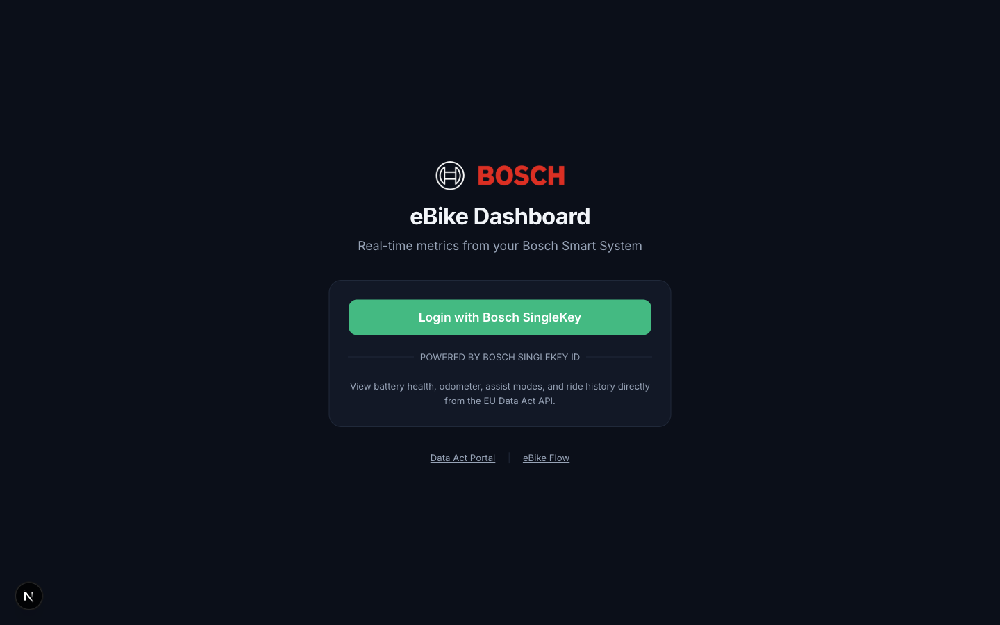
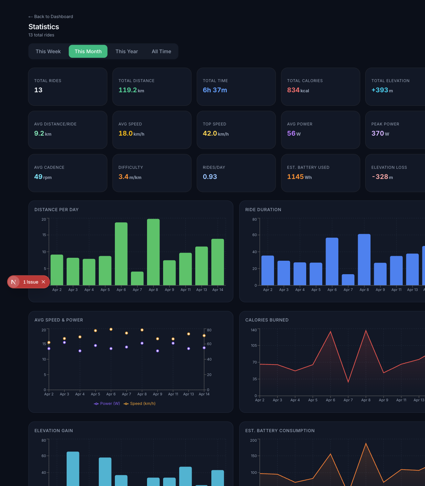

# Bosch eBike Dashboard

A read-only web dashboard for Bosch Smart System eBikes. View your battery health, ride history, GPS routes, and performance stats — all powered by the official Bosch Data Act API.

| Login | Statistics |
|:-----:|:----------:|
|  |  |

## Features

- **Battery Health** — Estimated charge %, cycle health, lifetime energy, avg Wh/km consumption
- **Odometer & Drive Unit** — Total km, motor hours, max assist speed, service due alerts
- **Assist Modes** — Eco/Auto/Sport/Turbo with estimated range per mode
- **Ride History** — All rides with mini GPS map previews, sortable by distance/speed/power/elevation
- **Ride Detail** — Full GPS route on interactive map (Street/Satellite/Topo), speed-colored track, elevation profile chart
- **Statistics** — Weekly/Monthly/Yearly/All-time stats with 6 interactive charts
- **Battery Consumption** — Per-ride estimated Wh and % battery drain
- **Export** — GPX export per ride (Strava/Komoot compatible), CSV export for all rides
- **Dark/Light Mode** — Theme toggle with full UI adaptation
- **eBike Details** — Complete hardware info (drive unit, battery, remote control serial numbers)

## Prerequisites

- **Node.js 18+** and npm
- A **Bosch Smart System eBike** (Performance Line, CX, SX, etc.)
- The **eBike Flow app** installed on your phone with at least one ride recorded
- A **Bosch SingleKey ID** account (created when you set up the Flow app)

## Setup Guide

### Step 1: Register Your App on Bosch Data Act Portal

1. Go to [portal.bosch-ebike.com/data-act/app](https://portal.bosch-ebike.com/data-act/app)
2. Log in with your SingleKey ID
3. Click **Create Application** and fill in:

   | Field | Value |
   |-------|-------|
   | Client application name | `ebike-dashboard` (or any name) |
   | Login URL | `http://localhost:3000/login` |
   | Redirect URI | `http://localhost:3000/api/auth/callback/bosch` |
   | Confidential client | **ON** (recommended) |

4. Submit and save the **Client ID** and **Client Secret** you receive

> **Note:** Bosch may take a few hours to approve your app. If it takes too long, try re-creating with "Confidential client" turned OFF for faster activation.

### Step 2: Enable Data Sharing

1. Go to [flow.bosch-ebike.com](https://flow.bosch-ebike.com) in your browser
2. Log in with your SingleKey ID
3. Find the **Data Act** section and authorize your `ebike-dashboard` app to access your data

### Step 3: Clone and Configure

```bash
git clone https://github.com/YOUR_USERNAME/ebike-dashboard.git
cd ebike-dashboard
npm install
```

Copy the example env file and fill in your credentials:

```bash
cp .env.example .env.local
```

Edit `.env.local`:

```env
AUTH_BOSCH_CLIENT_ID=euda-xxxxxxxx-xxxx-xxxx-xxxx-xxxxxxxxxxxx
AUTH_BOSCH_CLIENT_SECRET=xxxxxxxx-xxxx-xxxx-xxxx-xxxxxxxxxxxx
AUTH_SECRET=generate-a-random-secret-here
```

Generate the `AUTH_SECRET`:

```bash
npx auth secret
```

This will automatically add a random secret to your `.env.local`.

### Step 4: Run

```bash
npm run dev
```

Open [http://localhost:3000](http://localhost:3000) and click **Login with Bosch SingleKey**.

## Pages

| Route | Description |
|-------|-------------|
| `/login` | Login with Bosch SingleKey ID |
| `/dashboard` | Main dashboard — battery, odometer, assist modes, recent rides |
| `/dashboard/bike` | Full eBike hardware details (serial numbers, components) |
| `/dashboard/rides` | All rides with mini maps, sorting, CSV export |
| `/dashboard/rides/[id]` | Ride detail with GPS map, elevation profile, GPX export |
| `/dashboard/stats` | Statistics with charts — weekly/monthly/yearly/all-time |

## Tech Stack

- [Next.js 15](https://nextjs.org/) (App Router, Server Components)
- [TypeScript](https://www.typescriptlang.org/)
- [Tailwind CSS](https://tailwindcss.com/) + [shadcn/ui](https://ui.shadcn.com/)
- [Auth.js v5](https://authjs.dev/) (OAuth 2.0 with Bosch SingleKey/Keycloak)
- [Leaflet](https://leafletjs.com/) (interactive maps)
- [Recharts](https://recharts.org/) (statistics charts)
- [next-themes](https://github.com/pacocoursey/next-themes) (dark/light mode)

## Architecture

```
Browser                    Next.js Server              Bosch API
  |                            |                          |
  |-- Login click ------------>|                          |
  |                            |-- OAuth2 redirect ------>|
  |                            |<-- auth code ------------|
  |                            |-- exchange for tokens -->|
  |                            |<-- access + refresh -----|
  |                            |   (stored in JWT only)   |
  |                            |                          |
  |-- /dashboard ------------->|                          |
  |                            |-- GET /bikes ----------->|
  |                            |-- GET /activities ------>|
  |                            |<-- bike + ride data -----|
  |<-- rendered HTML ----------|                          |
  |                            |                          |
  |   (no tokens in browser)   |                          |
```

**Security:** All API calls to Bosch happen server-side. Access tokens are stored in encrypted JWT cookies and never exposed to browser JavaScript. The browser only receives rendered HTML and safe data props.

## Bosch API Endpoints Used

| Endpoint | Data |
|----------|------|
| `GET /bike-profile/smart-system/v1/bikes` | Bike profile, drive unit, batteries, service info |
| `GET /activity/smart-system/v1/activities` | Ride summaries (distance, speed, power, cadence, elevation, calories) |
| `GET /activity/smart-system/v1/activities/{id}/details` | GPS track points (lat, lng, altitude, speed, power per point) |

## Battery Consumption Estimates

The Bosch Data Act API does not provide live battery charge percentage. This dashboard estimates consumption per ride using:

```
Motor Wh  = riderPower_avg * duration_hours * 2.8 (motor multiplier)
System Wh = 10W * duration_hours (display, controller)
Climb Wh  = elevation_gain * 30kg * 9.81 / 3600
Total Wh  = Motor + System + Climb
Battery % = Total Wh / battery_capacity * 100
```

The motor multiplier (2.8) is calibrated for the Performance Line CX. Different drive units may need adjustment — edit `MOTOR_MULTIPLIER` in `src/lib/battery.ts`.

## Troubleshooting

### "No eBikes found" after login
- Make sure you enabled data sharing at [flow.bosch-ebike.com](https://flow.bosch-ebike.com)
- Your app may still be pending Bosch approval — wait a few hours and try again

### "Invalid redirect URI" during login
- Verify your Redirect URI is exactly: `http://localhost:3000/api/auth/callback/bosch`
- Make sure there are no trailing slashes

### Login redirects but no data appears
- Check that your eBike has the Smart System (not the older Classic Line)
- Ensure at least one ride is recorded in the eBike Flow app

### Token expired / session errors
- The dashboard auto-refreshes tokens. If you see persistent errors, sign out and sign back in
- If refresh tokens aren't issued, add `offline_access` to the scope in `src/auth.ts`

## Deployment

For production deployment (Vercel, Docker, etc.), set these environment variables:

```env
AUTH_BOSCH_CLIENT_ID=your-client-id
AUTH_BOSCH_CLIENT_SECRET=your-client-secret
AUTH_SECRET=your-random-secret
AUTH_BOSCH_ISSUER=https://p9.authz.bosch.com/auth/realms/obc
BOSCH_API_BASE_URL=https://api.bosch-ebike.com
NEXTAUTH_URL=https://your-domain.com
```

Update the **Redirect URI** in the Bosch Data Act Portal to match your production URL:
`https://your-domain.com/api/auth/callback/bosch`

## License

MIT

## Credits

- [Bosch eBike Systems](https://www.bosch-ebike.com/) — Data Act API
- [ha-bosch-ebike](https://github.com/Xunil99/ha-bosch-ebike) — Home Assistant integration that inspired this project
- [open-ebike](https://open-ebike.github.io/) — API documentation reference
